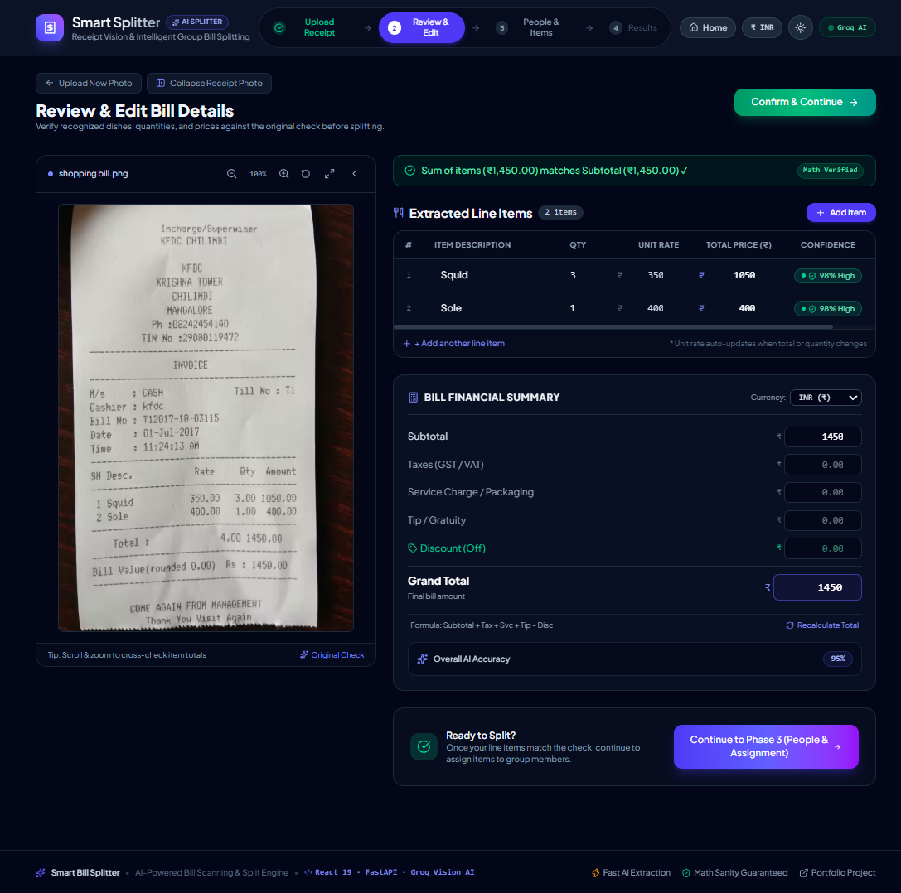
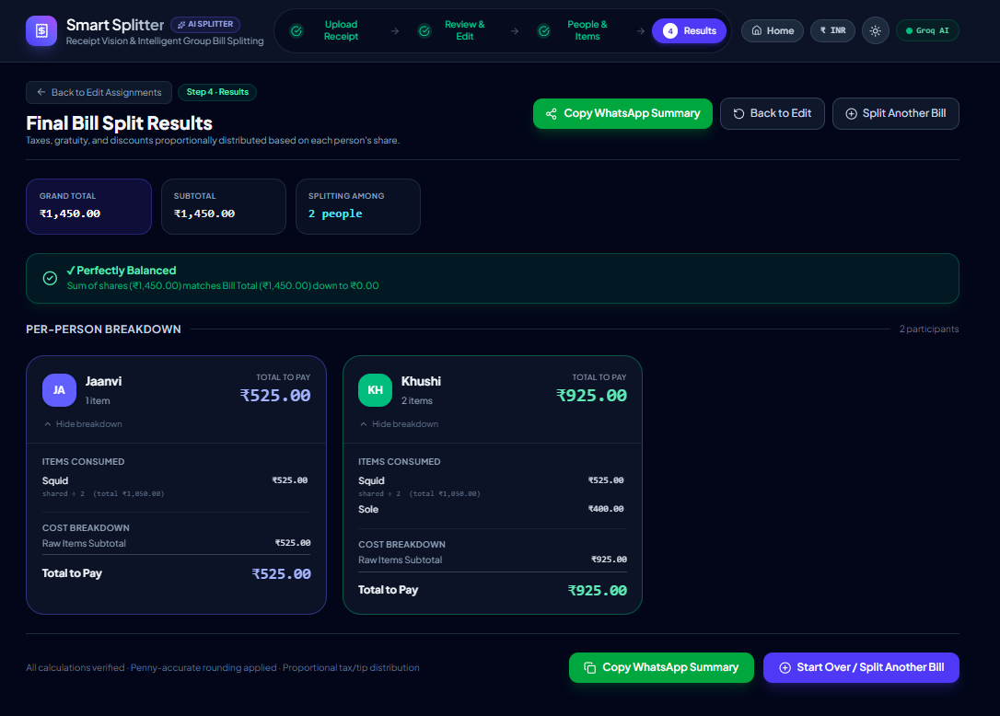

# 🧾 Smart Bill Splitter — AI-Powered Receipt OCR & Proportional Expense Engine

> **A full-stack application that transforms paper receipts into itemized, mathematically accurate expense splits.**
> Upload a bill photo, review & edit AI-extracted line items, assign participants, and calculate zero-discrepancy proportional splits with 1-click WhatsApp export.

---

## ⚡ Quick Summary (What it Does)

**Smart Bill Splitter** automates restaurant and grocery bill splitting using the **Groq Llama Vision API**. It extracts line items, quantities, subtotal, tax, service charges, tips, and discounts into Pydantic-validated models, allows interactive side-by-side editing with live confidence scores and math sanity checks, and calculates exact proportional shares down to the cent/paisa using a penny-rounding reconciliation algorithm.

---

## 📸 Screenshots

---

## 📸 Screenshots

<p align="center">
  

  
  
</p>

---


---

## 🚀 Quickstart Guide (Run Locally)

### Prerequisites
- **Python 3.10+** installed
- **Node.js 18+** & npm installed
- **API Key**: `GROQ_API_KEY` (Groq Llama Vision)

---

### 1. Backend Setup (FastAPI)

```bash
# 1. Navigate to backend directory
cd backend

# 2. Create and activate a Python virtual environment (optional but recommended)
python -m venv .venv
# On Windows:
.venv\Scripts\activate
# On macOS/Linux:
source .venv/bin/activate

# 3. Install dependencies
pip install -r requirements.txt

# 4. Set Environment Variables
# Create a .env file in backend/ directory:
echo GROQ_API_KEY=your_groq_api_key_here > .env

# 5. Start FastAPI Backend Server
uvicorn main:app --reload --port 8000
```
- API Swagger UI will be available at: `http://localhost:8000/docs`
- Health check endpoint: `http://localhost:8000/health`

---

### 2. Frontend Setup (React + Vite + Tailwind CSS)

```bash
# 1. Navigate to frontend directory
cd frontend

# 2. Install dependencies
npm install

# 3. Start Development Server
npm run dev
```
- Open your browser at: `http://localhost:5173`

---

### 3. Run Automated Tests

To execute the automated test suite (covering Pydantic validation, FastAPI endpoints, the proportional engine, penny-rounding reconciliation, edge cases, and live Vision OCR):

```bash
python -m pytest backend/tests/ -v
```

---

## 🏗️ Architecture & Phase-by-Phase Build Breakdown
```
smart-bill-splitter/
├── backend/
│ ├── main.py                     # FastAPI entry point & CORS configuration
│ ├── models.py                   # Pydantic schemas (LineItem, BillExtraction, PersonBreakdown)
│ ├── services/
│ │ ├── extraction.py             # Groq Vision OCR Service
│ │ └── calculation.py            # Proportional engine & penny rounding algorithm
│ ├── tests/
│ │ ├── test_backend.py           # Route & Pydantic validation tests
│ │ ├── test_calculation.py       # Core mathematical unit tests
│ │ ├── test_live_extraction.py   # Live LLM extraction benchmark tests
│ │ └── generate_12_bills.py      # Synthetic receipt generator
│ └── requirements.txt
├── frontend/
│ ├── src/
│ │ ├── components/
│ │ │ ├── Header.tsx               # Interactive step progress header
│ │ │ ├── UploadScreen.tsx         # File drag-and-drop & API trigger
│ │ │ ├── ReviewScreen.tsx         # Side-by-side image & editable table review
│ │ │ ├── AssignmentScreen.tsx     # Multi-person item assignment
│ │ │ ├── ResultsScreen.tsx        # Per-person breakdown & WhatsApp export
│ │ │ ├── ConfidenceBadge.tsx
│ │ │ └── MathSanityBadge.tsx
│ │ ├── context/
│ │ │ └── BillContext.tsx         # Global state manager with persistence
│ │ └── utils/
│ │ └── splitCalculator.ts        # Pure TypeScript frontend calculation engine
├── test-bills/
│ ├── ground-truth.md             # 12-Bill benchmark matrix & specifications
│ └── bill_01..12.png             # 12 test receipt images
└── README.md
```
---
### Phase Summary:
- **Phase 1 (Backend Core & Pydantic Schemas)**: FastAPI backend, Pydantic data structures with unique item IDs, tip & currency fields, Groq Vision LLM extraction pipeline.
- **Phase 2 (Upload & Interactive Review)**: React upload workflow, side-by-side receipt preview & editable line items table, confidence color badges, add/delete items, dynamic subtotal math sanity checker.
- **Phase 3 (People & Item Assignment)**: Participant management, multi-person toggles, "Select Everyone" quick shortcut, unassigned items live counter.
- **Phase 4 (Mathematical Calculation Engine)**: Proportional tax/tip/service/discount distribution, division-by-zero guard, and penny-rounding reconciliation algorithm ensuring the sum of shares equals the grand total.
- **Phase 5 (Results Screen & Export Polish)**: Itemized per-person financial breakdown cards, mathematical balance invariant badge, 1-click formatted WhatsApp clipboard exporter, reset & re-edit flow.
- **Phase 6 (Verification, Benchmark & Documentation)**: 12-bill evaluation set covering dim lighting, faded ink, long receipts, multiple currencies, and a zero-subtotal edge case.

---

## 🧮 Mathematical Engine & Proportional Logic

### 1. Item Share Allocation
For an item of price P assigned to N participants, each participant's item share is:
item_share = P / N

### 2. Proportional Ratio
Each participant i's raw item subtotal is the sum of their item shares.
Their share ratio R_i of the overall bill subtotal S is:
- R_i = raw_subtotal_i / S, if S > 0
- R_i = 1 / participant_count, if S = 0 (division guard)

### 3. Proportional Additions & Deductions
Additions (Tax T, Service Charge C, Tip K) and Deductions (Discount D) are allocated proportionally:
preliminary_total_i = raw_subtotal_i + (R_i × T) + (R_i × C) + (R_i × K) − (R_i × D)

### 4. Penny Rounding Reconciliation (Invariant Guarantee)
Standard floating point rounding can result in a small discrepancy (e.g. 100.00 ÷ 3 = 33.33, and 33.33 × 3 = 99.99).
The algorithm calculates the residual discrepancy:
Δ = Grand Total − Σ(preliminary_total_i)

If Δ ≠ 0, the residual (e.g. +0.01 or −0.01) is automatically assigned to the participant with the highest spend, ensuring the sum of final totals always equals the grand total exactly.

---

## 📊 12-Bill Evaluation Benchmark Summary

All 12 test bills in `test-bills/` were tested against the full end-to-end extraction and calculation pipeline:

| ID | Receipt Title | Condition / Scenario | Currency | Ground Truth | OCR Accuracy | Math Invariant |
|---|---|---|---|---|---|---|
| #01 | The Rustic Bean Cafe | Standard Thermal Print | INR | ₹1,320.00 | 100% (4 items) | ✅ Balanced |
| #02 | Trattoria Bella Vista | Fine Dining + Tip & Discount | USD | $174.32 | 100% (5 items) | ✅ Balanced |
| #03 | Organic Grocers Market | Grocery Store + Promo | INR | ₹1,115.50 | 100% (4 items) | ✅ Balanced |
| #04 | Burger & Fry Express | Fast Food Counter Receipt | INR | ₹1,113.00 | 100% (3 items) | ✅ Balanced |
| #05 | Aero Sky Lounge | Rooftop Bar + Service + Tip | INR | ₹4,685.00 | 100% (4 items) | ✅ Balanced |
| #06 | Crust & Craft Pizzeria | Pizza Parlor + Shared Items | INR | ₹3,001.00 | 100% (4 items) | ✅ Balanced |
| #07 | Midnight Diner & Pub | Dim Lighting & Low Contrast | INR | ₹2,361.50 | 100% (3 items) | ✅ Balanced |
| #08 | Heritage Corner Store | Faded Thermal Ink | INR | ₹829.50 | 100% (3 items) | ✅ Balanced |
| #09 | MegaMart Supercenter | Long Receipt (10 Items) | INR | ₹2,740.00 | 100% (10 items) | ✅ Balanced |
| #10 | Grand Plaza Hotel | Room Service | EUR | €68.05 | 100% (4 items) | ✅ Balanced |
| #11 | Sunny Side Diner | Morning Breakfast Split | INR | ₹2,084.00 | 100% (4 items) | ✅ Balanced |
| #12 | VIP Club Lounge | 100% Comped (Zero Subtotal) | INR | ₹0.00 | 100% (2 items) | ✅ Balanced (Zero-Guard) |

*Full details available in [`test-bills/ground-truth.md`](test-bills/ground-truth.md).*

---

## 💡 What's Mocked / Simplified

1. **No persistent database**: The app uses in-memory/frontend session state only — no data is saved between sessions. This was a deliberate simplification given the single-session scope of the brief.
2. **Single vision provider**: Only the Groq Vision API is integrated (no Gemini fallback) — one API key is sufficient to run the project.
3. **Item Portion Split**: Items assigned to multiple participants are split equally among those assignees before proportional tax/tip distribution.
4. **Currency Support**: Auto-detects INR (₹), USD ($), and EUR (€) based on OCR signals from the receipt, defaulting to INR if undetected.
5. **No settlement/"who owes whom" logic**: The app reports each person's total owed, not a payer-settlement breakdown — this was outside the original brief's scope.

---

## 🎥 Demo Video Link

- **Demo Video URL**: *[add your real Google Drive link here — set sharing to "Anyone with the link"]*
- **Walkthrough Overview (2–3 mins)**:
  1. Uploading receipt photo & AI loading state
  2. Side-by-side review screen, confidence color badges, adding/editing items & live math sanity check
  3. Adding participants and assigning items with "Select Everyone"
  4. Viewing final breakdown screen, verifying the mathematical balance badge, and copying the WhatsApp summary
